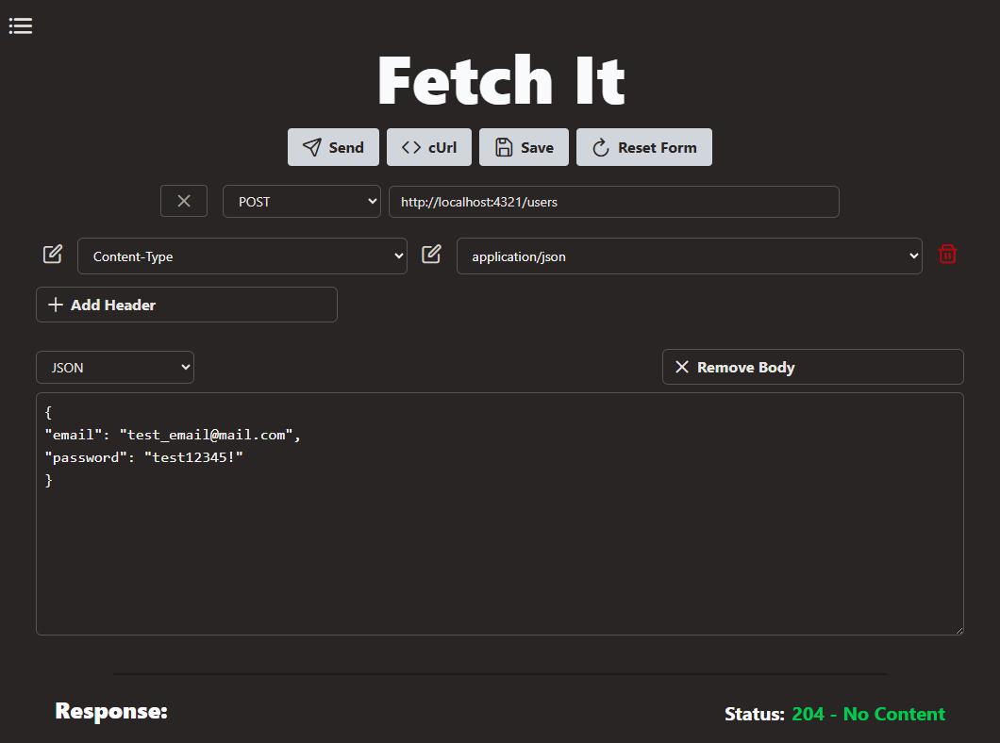
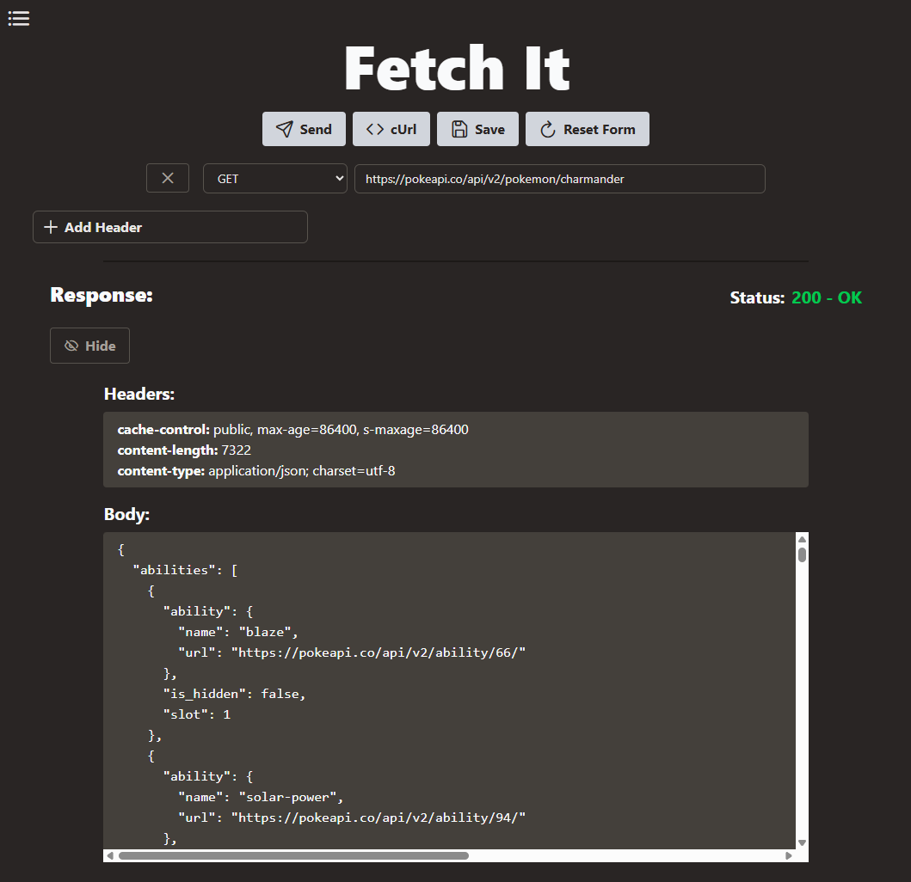
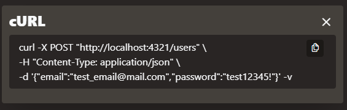
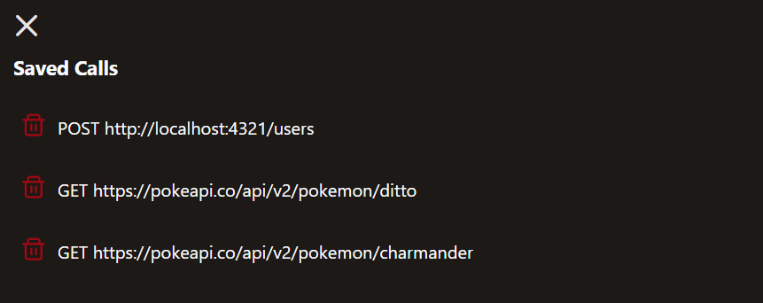

# Fetch It

> A completely client-side and privacy-respecting alternative to test API calls.

[](https://rucev.github.io/fetch-it/)
[](https://github.com/rucev/fetch-it/actions)

---

## Features

- **Custom API Requests**
  - Set URL, method, headers, and body
  - Currently, allows custom headers and this [default ones](./app/src/constants/headerNames.ts).
  - Supports body types: `text`, `JSON`, and `XML`

  


- **Response Display**
  - Status code + message (color-coded)
  - Headers and body in a user-friendly view

  

- **cURL Generator**
  - Create and copy cURL equivalent to clipboard

  

- **LocalStorage Integration**
  - Save and load request history (including response)

  

---

## Tech Stack

- [**Vue 3**](https://vuejs.org/)
- [**Vite**](https://vite.dev/guide/)
- [**TypeScript**](https://www.typescriptlang.org/)
- [**TailwindCSS**](https://tailwindcss.com/)
- [**PrimeIcons**](https://primevue.org/icons/)

- Tested with [**Vitest**](https://vitest.dev/) and [**Testing Library**](https://testing-library.com/docs/)

---

## Project Structure

```
fetch-it/
├── .github/ # CI/CD workflows
├── app/
│ │   tests_/ # Unit and component tests, following src structure
│ ├── public/
│ ├── src/ # Main source code
│ │ ├── components/ 
│ │ ├── constants/ # Static values like HTTP methods
│ │ ├── core/ # Core logic or services
│ │ ├── interfaces/ # TypeScript interfaces
│ │ ├── repository/ # LocalStorage utilities
│ │ ├── validators/
│ │ ├── App.vue
│ │ ├── main.ts
│ │ └── style.css
│ ├── vite-env.d.ts
│ ├── vue-shims.d.ts
│ ├── vite.config.ts
│ ├── vitest.config.ts
│ ├── vitestSetup.ts
│ ├── tsconfig*.json
│ └── index.html
├── docs/
├── LICENSE
└── README.md
```

## Getting Started

### Prerequisites

- [Node.js](https://nodejs.org/es)

### Installation

```bash
git clone https://github.com/rucev/fetch-it.git
cd fetch-it/app
npm install
```

### Run Locally

```bash
npm run dev
```

### Build

```bash
npm run build
```

### Preview

```bash
npm run preview
```

### Run tests

```bash
npm run test
```

## Deployment

The app is deployed using GitHub Pages via a CI/CD workflow on the main branch: [check it out!](https://github.com/rucev/fetch-it/actions)

## Roadmap
### Features

- [x] Import/export saved requests [#3](https://github.com/rucev/fetch-it/issues/3)
- [ ] Collections to organize saved calls [#4](https://github.com/rucev/fetch-it/issues/4)
- [ ] Postman/Insomnia file import support [#5](https://github.com/rucev/fetch-it/issues/5)
- [ ] Advanced cURL customization (multiline, verbose) [#6](https://github.com/rucev/fetch-it/issues/6)
- [ ] And more enhancements...

## Contributing
Contributions are welcome! To get started:

1. Fork the repository

2. Create your feature branch:
```bash
git checkout -b feature/my-great-feature
```

3. Create an [issue](https://github.com/rucev/fetch-it/issues) to let people now in what your working on.

4. Commit your changes:
```bash
git commit -m 'add great feature #<issue-number> 
```

5. Push to the branch:
```bash
git push origin feature/my-great-feature
```

6. Open a [pull request](https://github.com/rucev/fetch-it/pulls).

Make sure to check the following [guidelines](./docs/CONTRIBUTING.md)